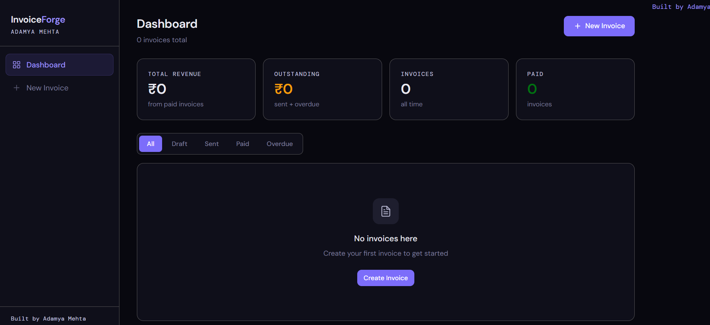
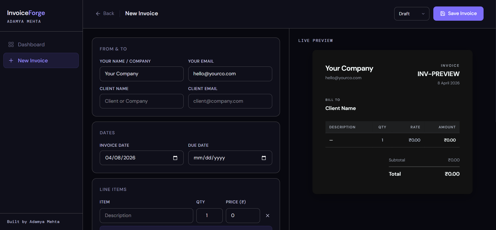
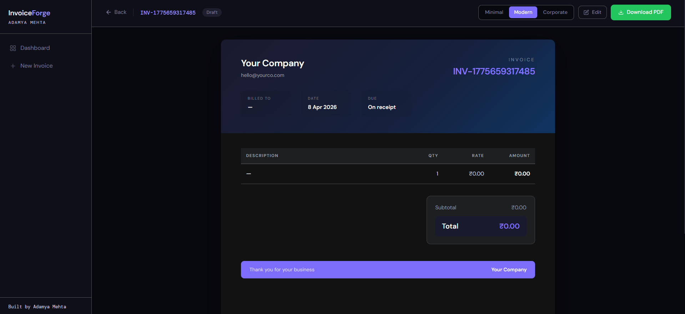

# 🚀 InvoiceForge

A modern, responsive **Invoice Generator Web App** built with React, Tailwind CSS, and Local Storage.

🔗 **Live Demo:** https://invoice-forge-beige.vercel.app/
📦 **GitHub Repo:** https://github.com/AdamyaMehta07/InvoiceForge

---

## ✨ Features

* 🧾 Create, edit, and manage invoices
* 👀 Live invoice preview
* 📄 Download invoices as PDF
* 📊 Dashboard with analytics (total invoices, revenue, average value)
* 🎨 Modern SaaS UI (glassmorphism + gradient blobs)
* 💾 Persistent data using Local Storage
* ⚡ Fast, clean, and responsive design

---

## 🛠️ Tech Stack

* **Frontend:** React.js
* **Styling:** Tailwind CSS
* **Routing:** React Router
* **PDF Generation:** html2canvas + jsPDF
* **State Management:** React Hooks
* **Storage:** Browser Local Storage

---

## 📸 Screenshots

> 📌 Make sure you add images inside: `public/screenshots/`

### 🏠 Dashboard



---

### 🧾 Create Invoice



---

### 👀 Invoice Preview



---

## 📂 Project Structure

```
src/
 ├── components/
 │    ├── Navbar.jsx
 │    ├── Hero.jsx
 │    ├── Stats.jsx
 │    ├── Layout.jsx
 │    ├── InvoicePreview.jsx
 │
 ├── pages/
 │    ├── Dashboard.jsx
 │    ├── CreateInvoice.jsx
 │    ├── ViewInvoice.jsx
 │
 ├── App.jsx
 ├── main.jsx
```

---

## ⚙️ Installation & Setup

Clone the repository:

```
git clone https://github.com/AdamyaMehta07/InvoiceForge.git
cd InvoiceForge
```

Install dependencies:

```
npm install
```

Run the app:

```
npm run dev
```

---

## 🚀 Future Improvements

* 🔍 Search & filter invoices
* 📅 Date-based filtering
* 🌙 Dark mode toggle
* ☁️ Backend integration (Firebase / Node.js)
* 👤 User authentication

---

## 🙌 Author

**Adamya Mehta**

* GitHub: https://github.com/AdamyaMehta07
* LinkedIn: https://www.linkedin.com/in/adamya-mehta-0b57b736a/

---

## ⭐ Show Your Support

If you like this project:

* ⭐ Star the repository
* 🍴 Fork it
* 📢 Share it

---

## 📜 License

This project is licensed under the MIT License.
